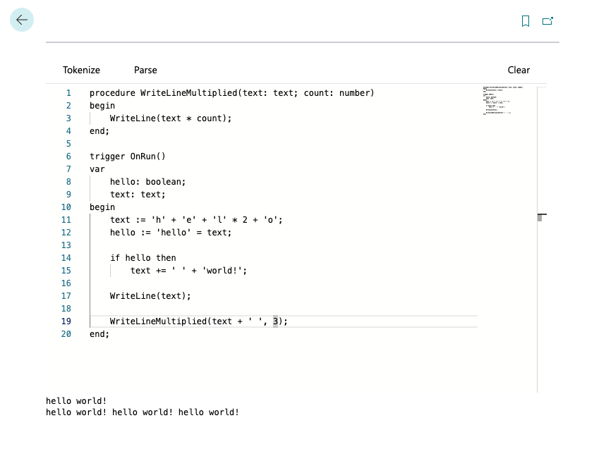

# SAL2

Scripting in AL - attempt #2.

## app

Business Central extension adding a code editor for running scripts.



### What does it do?

Currently? Not much. Code is parsed, semantically analyzed and executed. Message with the memory state is displayed at the end of each procedure execution.

### Goals

1. Support copy-and-pasting existing AL code and running it without any changes
1. Add new features to make life easier

### Limitations

!TODO describe current implementation limitations

### Sample code

The entry point is a parameterless `trigger` called `OnRun`. You can define additional procedures with `var` parameters and (named) return values.
Global variables are not supported (yet?).

```sal
procedure WriteLineMultiplied(text: text; count: integer)
begin
    WriteLine(text * count);
end;

trigger OnRun()
var
    hello: boolean;
    text: text;
begin
    text := 'h' + 'e' + 'l' * 2 + 'o';
    hello := 'hello' = text;

    if hello then
        text += ' ' + 'world!';

    WriteLine(text);

    WriteLineMultiplied(text + ' ', 3);
end;
```

### Supported features

#### Data types

| type                                | status | remark                                                                                                                                                                                  |
|-------------------------------------|--------|-----------------------------------------------------------------------------------------------------------------------------------------------------------------------------------------|
| `boolean`                           | ✅      |                                                                                                                                                                                         |
| `text`                              | ✅      |                                                                                                                                                                                         |
| `code`                              | ✅      |                                                                                                                                                                                         |
| `guid`                              | ✅      |                                                                                                                                                                                         |
| `enum`                              | ⭕️     | Planned (but maybe not possible outside of record fields?).                                                                                                                             |
| `option`                            | ⭕️     | Planned.                                                                                                                                                                                |
| `integer`                           | ✅      |                                                                                                                                                                                         |
| `decimal`                           | ✅      |                                                                                                                                                                                         |
| `char`                              | ✅      |                                                                                                                                                                                         |
| `byte`                              | ⭕️     |                                                                                                                                                                                         |
| `date`                              | ✅      |                                                                                                                                                                                         |
| `time`                              | ✅      |                                                                                                                                                                                         |
| `datetime`                          | ✅      |                                                                                                                                                                                         |
| `dateformula`                       | ✅      |                                                                                                                                                                                         |
| `duration`                          | ⭕️     |                                                                                                                                                                                         |
| `record`                            | ✅ ⭕️   | Temporary records are not supported - yet.                                                                                                                                              |
| `recordid`                          | ⭕️     |                                                                                                                                                                                         |
| `recordref` & `fieldref` & `keyref` | ❓      | Should be possible to implement - at least partially.                                                                                                                                   |
| `blob` & `outstream` & `instream`   | ⭕️     |                                                                                                                                                                                         |
| `textbuilder`                       | ⭕️     |                                                                                                                                                                                         |
| `variant`                           | ❓      | Should be possible to implement - at least partially.                                                                                                                                   |
| `dialog`                            | ❓      | Low priority.                                                                                                                                                                           |
| `dictionary`                        | ❓      | Low priority.                                                                                                                                                                           |
| `list`                              | ❓      | Low priority.                                                                                                                                                                           |
| `codeunit`                          | ❌ ❓    | Runtime reflection for codeunits is not possible (at least as far as I know). `Codenit.Run(Integer)` is possible. It could be possible by generating another extension with "bindings"? |
| `page`                              | ❌ ❓    | Same as codeunits. `Page.Run(Integer)` is possible.                                                                                                                                     |
| `report`                            | ❌ ❓    | Same as codeunits. `Report.Run(Integer)` is possible.                                                                                                                                   |
| `json*`                             | ❓      | Low priority.                                                                                                                                                                           |
| `xml*`                              | ❓      | Low priority.                                                                                                                                                                           |
| `http*`                             | ❓      | Low priority.                                                                                                                                                                           |
| others                              | ❓      | No priority.                                                                                                                                                                            |

##### Key

- ✅ - supported
- ⭕️ - planned/partially supported
- ❓ - not supported/not planned
- ❌ - not possible

##### Record methods

| type                                                                        | status | remark                      |
|-----------------------------------------------------------------------------|--------|-----------------------------|
| `AddLink(URL: Text, [Description: Text]): Integer`                          | ⭕️     |                             |
| `AddLoadFields([Field: Identifier, ...])`                                   | ⭕️     |                             |
| `AreFieldsLoaded(Field: Identifier, ...): Boolean`                          | ⭕️     |                             |
| `Ascending([Ascending: Boolean]): Boolean`                                  | ⭕️     |                             |
| `CalcFields(Field: Identifier, [Field: Identifier, ...])`                   | ⭕️     |                             |
| `CalcSums(Field: Identifier, [Field: Identifier, ...])`                     | ⭕️     |                             |
| `ChangeCompany([Company: Text])[: Boolean]`                                 | ⭕️     |                             |
| `ClearMarks()`                                                              | ⭕️     |                             |
| `Consistent(Consistent: Boolean)`                                           | ⭕️     |                             |
| `Copy(FromRecord: Record, [ShareTable: Boolean])`                           | ⭕️     |                             |
| `CopyFilter(Any, Any)`                                                      | ⭕️     |                             |
| `CopyFilters(var Record)`                                                   | ⭕️     |                             |
| `CopyLinks(var Record)`                                                     | ⭕️     |                             |
| `CopyLinks(RecordRef)`                                                      | ⭕️     |                             |
| `Count(): Integer`                                                          | ✅      |                             |
| `CountApprox(): Integer`                                                    | ⭕️     |                             |
| `CurrentCompany(): Text`                                                    | ⭕️     |                             |
| `CurrentKey(): Text`                                                        | ⭕️     |                             |
| `Delete([RunTrigger: Boolean])[: Boolean]`                                  | ✅      |                             |
| `DeleteAll([Boolean])`                                                      | ⭕️     |                             |
| `DeleteLink(Integer)`                                                       | ⭕️     |                             |
| `DeleteLinks()`                                                             | ⭕️     |                             |
| `FieldActive(Any)`                                                          | ⭕️     |                             |
| `FieldCaption(Any)`                                                         | ⭕️     |                             |
| `FieldError(Any [, Text])`                                                  | ⭕️     |                             |
| `FieldError(Any, ErrorInfo)`                                                | ⭕️     |                             |
| `FieldName(Any)`                                                            | ⭕️     |                             |
| `FieldNo(Field: Identifier): Integer`                                       | ✅      |                             |
| `FilterGroup([Integer])`                                                    | ⭕️     |                             |
| `Find([Text])`                                                              | ⭕️     |                             |
| `FindFirst()[: Boolean]`                                                    | ✅      |                             |
| `FindLast()[: Boolean]`                                                     | ✅      |                             |
| `FindSet()[: Boolean]`                                                      | ✅      |                             |
| `FindSet([Boolean])`                                                        | ⭕️     |                             |
| `FindSet(Boolean, Boolean)`                                                 | ⭕️     |                             |
| `Get([Any,...])`                                                            | ⭕️     |                             |
| `GetAscending(Any)`                                                         | ⭕️     |                             |
| `GetBySystemId(Guid)`                                                       | ⭕️     |                             |
| `GetFilter(Any)`                                                            | ⭕️     |                             |
| `GetFilters(): Text`                                                        | ✅      |                             |
| `GetPosition([Boolean])`                                                    | ⭕️     |                             |
| `GetRangeMax(Any)`                                                          | ⭕️     |                             |
| `GetRangeMin(Any)`                                                          | ⭕️     |                             |
| `GetView([UseNames: Boolean]): Text`                                        | ✅      |                             |
| `HasFilter()`                                                               | ⭕️     |                             |
| `HasLinks()`                                                                | ⭕️     |                             |
| `Init()`                                                                    | ✅      |                             |
| `Insert([RunTrigger: Boolean])[: Boolean]`                                  | ✅      |                             |
| `Insert(Boolean, Boolean)`                                                  | ⭕️     |                             |
| `IsEmpty(): Boolean`                                                        | ✅      |                             |
| `IsTemporary()`                                                             | ⭕️     |                             |
| `LoadFields(Any,...)`                                                       | ⭕️     |                             |
| `LockTable([Boolean] [, Boolean])`                                          | ⭕️     |                             |
| `Mark([Boolean])`                                                           | ⭕️     |                             |
| `MarkedOnly([Boolean])`                                                     | ⭕️     |                             |
| `Modify([RunTrigger: Boolean])[: Boolean]`                                  | ✅      |                             |
| `ModifyAll(Any, Any [, Boolean])`                                           | ⭕️     |                             |
| `Next([Steps: Integer]): Integer`                                           | ✅      |                             |
| `ReadConsistency()`                                                         | ⭕️     |                             |
| `ReadIsolation([IsolationLevel])`                                           | ⭕️     |                             |
| `ReadPermission()`                                                          | ⭕️     |                             |
| `RecordId()`                                                                | ⭕️     |                             |
| `RecordLevelLocking()`                                                      | ⭕️     |                             |
| `Relation(Any)`                                                             | ⭕️     |                             |
| `Rename(Any [, Any,...])`                                                   | ⭕️     |                             |
| `Reset()`                                                                   | ✅      |                             |
| `SecurityFiltering([SecurityFilter])`                                       | ⭕️     |                             |
| `SetAscending(Any, Boolean)`                                                | ⭕️     |                             |
| `SetAutoCalcFields([Any,...])`                                              | ⭕️     |                             |
| `SetCurrentKey(Any [, Any,...])`                                            | ⭕️     |                             |
| `SetFilter(Field: Identifier, Filter: Tex, [Substitution: Any, ...])`       | ✅      | only up to 10 substitutions |
| `SetLoadFields([Any,...])`                                                  | ⭕️     |                             |
| `SetPermissionFilter()`                                                     | ⭕️     |                             |
| `SetPosition(Text)`                                                         | ⭕️     |                             |
| `SetRange(Field: Identifier, [FromValue: FieldType, [ToValue: FieldType]])` | ✅      |                             |
| `SetRecFilter()`                                                            | ✅      |                             |
| `SetView(View: Text)`                                                       | ✅      |                             |
| `TableCaption(): Text`                                                      | ✅      |                             |
| `TableName(): Text`                                                         | ✅      |                             |
| `TestField(Any)`                                                            | ⭕️     |                             |
| `TestField(Any, ErrorInfo)`                                                 | ⭕️     |                             |
| `TransferFields(var Record [, Boolean])`                                    | ⭕️     |                             |
| `TransferFields(var Record, Boolean, Boolean)`                              | ⭕️     |                             |
| `Validate(Field: Identifier, [FromValue: FieldType])`                       | ✅      |                             |
| `WritePermission()`                                                         | ⭕️     |                             |

##### Text methods

| type                                     | status | remark                      |
|------------------------------------------|--------|-----------------------------|
| `ConvertStr(Text, Text, Text)`           | ✅      |                             |
| `CopyStr(Text, Integer [, Integer])`     | ✅      |                             |
| `DelChr(Text [, Text] [, Text])`         | ✅      |                             |
| `DelStr(Text, Integer [, Integer])`      | ✅      |                             |
| `IncStr(Text)`                           | ✅      |                             |
| `InsStr(Text, Text, Integer)`            | ✅      |                             |
| `LowerCase(Text)`                        | ✅      |                             |
| `MaxStrLen(Text)`                        | ✅      |                             |
| `PadStr(Text, Integer [, Text])`         | ✅      |                             |
| `SelectStr(Integer, Text)`               | ✅      |                             |
| `StrCheckSum(Text [, Text] [, Integer])` | ✅      |                             |
| `StrLen(Text)`                           | ✅      |                             |
| `StrPos(Text, Text)`                     | ✅      |                             |
| `StrSubstNo(Text [, Any,...])`           | ✅      | only up to 10 substitutions |
| `UpperCase(Text)`                        | ✅      |                             |
| `Contains(Text: Text): Boolean`          | ✅      |                             |
| `EndsWith(Text)`                         | ✅      |                             |
| `IndexOf(Text [, Integer])`              | ✅      |                             |
| `IndexOfAny(Text [, Integer])`           | ✅      |                             |
| `IndexOfAny(List of [Char] [, Integer])` | ⭕️     |                             |
| `LastIndexOf(Text [, Integer])`          | ✅      |                             |
| `PadLeft(Integer [, Char])`              | ✅      |                             |
| `PadRight(Integer [, Char])`             | ✅      |                             |
| `Remove(Integer [, Integer])`            | ✅      |                             |
| `Replace(Text, Text)`                    | ✅      |                             |
| `Split([Text,...])`                      | ⭕️     |                             |
| `Split(List of [Text])`                  | ⭕️     |                             |
| `Split(List of [Char])`                  | ⭕️     |                             |
| `StartsWith(Text)`                       | ✅      |                             |
| `Substring(Integer [, Integer])`         | ✅      |                             |
| `ToLower(): Text`                        | ✅      |                             |
| `ToUpper(): Text`                        | ✅      |                             |
| `Trim()`                                 | ✅      |                             |
| `TrimEnd([Text])`                        | ✅      |                             |
| `TrimStart([Text])`                      | ✅      |                             |

#### Statements

- assignment (`:=`, `+=`, `-=`, `*=`, `/=`)
- `while` loop
- `for` loop (both `to` and `downto`)
- `repeat-until` loop
- `if` and `if-else` statement
- `exit` statement - both variants, with and without an expression

!TODO list unsupported statements - `case`, `foreach`, `break`, ?

#### Operators

- unary operators
  - numeric (`+`, `-`)
  - boolean (`not`)
- binary operators
  - comparison (`<`, `<=`, `<>`, `>=`, `>`, `=`)
  - numeric (`+`, `-`, `*`, `/`, `mod`, `div`)
  - boolean (`and`, `or`, `xor`)
  - text (`+`, `*`)
    - !TODO explain `*` operator
  - date (`+`, `-`)
  - time (`+`, `-`)
  - datetime (`+`, `-`)

#### Built-in functions

- `Message(Text: Text, [Substitution: Any, ...])` (up to 10 substitutions)
- `Error(Text: Text, [Substitution: Any, ...])` (up to 10 substitutions)
- `WriteLine(Text: Text, [Substitution: Any, ...])` (up to 10 substitutions)
- `Abs(Number: Decimal): Decimal`
- `Power(Number: Decimal, Power: Decimal): Decimal`
- `Format(Input: Any, [Length: Integer, [FormatNumber: Integer]]): Text`
- `Format(Input: Any, [Length: Integer, [FormatString: Text]]): Text`
- `CalcDate(Formula: Text, [Date: Date]): Date`
- `CalcDate(Formula: DateFormula, [Date: Date]): Date`
- `ClosingDate(Date: Date): Date`
- `CreateDateTime(Date: Date, Time: Time): DateTime`
- `CurrentDateTime(): DateTime`
- `NormalDate(Date: Date): Date`
- `Time(): Time`
- `Today(): Date`
- `WorkDate([WorkDate: Date]): Date`
- `Date2DMY(Date: Date, Part: Integer): Integer`
- `Date2DWY(Date: Date, Part: Integer): Integer`
- `DMY2Date(Day: Integer, [Month: Integer, [Year: Integer]]): Date`
- `DWY2Date(WeekDay: Integer, [Week: Integer, [Year: Integer]]): Date`
- `DT2Date(DateTime: DateTime): Date`
- `DT2Time(DateTime: DateTime): Time`
- `CreateGuid(): Guid`
- `IsNullGuid(Guid: Guid): Boolean`
- `Evaluate(var Value: Any, Input: Text, [FormatNumber: Integer])[: Boolean]`

!TODO list unsupported and planned

### Planned

1. editor improvements
    - ui improvements (render empty lines)
    - highlighting
    - intellisense
1. more built-in functions and methods
1. `option`, `enum`, others
1. allow `Record.SetRange(Record.Field, ...);`
1. strlen as a method?

## editor

React app addin using the [Monaco Editor](https://github.com/microsoft/monaco-editor) for script input.
